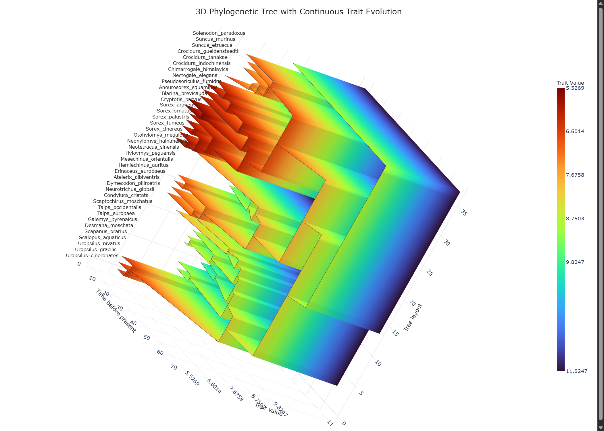
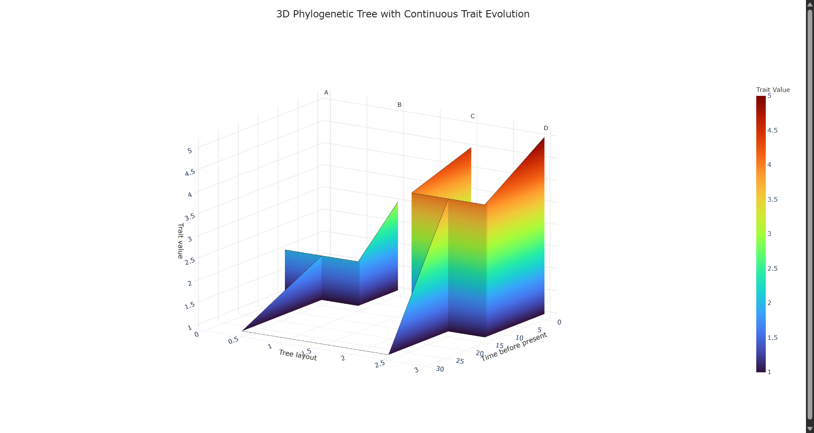
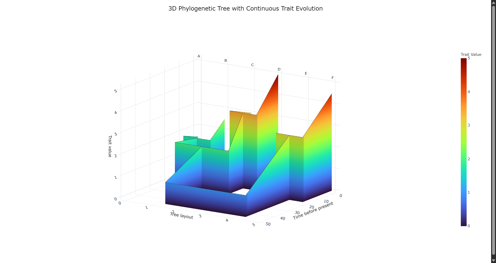

# Phylo3D-Trait

Universal interactive 3D phylogenetic tree visualization tool with continuous trait evolution.

Visualizes phylogenetic tree topology, evolutionary time, and continuous trait changes as an interactive 3D WebGL (Plotly) visualization in standalone, offline-viewable HTML.

<p align="center">
  
</p>

> 📖 **面向 AI Agent 与科研用户的完整操作手册**：参见 [**`docs/PHYLO3D_TRAIT_USAGE_GUIDE.md`**](docs/PHYLO3D_TRAIT_USAGE_GUIDE.md)。

---

## 1. Overview

### What Phylo3D-Trait Does
- **Input**:
  1. Phylogenetic tree (Newick or Nexus format).
  2. Trait values table (CSV or TSV) containing continuous trait values for all tips and internal/ancestral nodes.
- **Output**:
  - A standalone, publication-quality interactive 3D HTML visualization (*eLife* Figure 5 style) featuring an orthogonal rectangular phylogram with continuous vertical curtain meshes.

### What Phylo3D-Trait Does NOT Do
> [!IMPORTANT]
> **No Built-in Ancestral State Reconstruction**:
> **Phylo3D-Trait does NOT perform ancestral-state reconstruction (ASR).** All tip and internal-node trait values must be computed beforehand by the user (e.g. via `phytools::fastAnc()`, `ape::ace()`, Brownian motion, or Ornstein-Uhlenbeck models in R/Python) and provided in the trait values table.

---

## 2. Scientific Coordinate System

The 3D coordinate space maps strictly as follows:

| Axis | Scientific Meaning | Description |
|---|---|---|
| **X** | **Tree Layout** | Horizontal separation of lineages ($0, 1, \dots, N-1$ at terminal tips; internal nodes positioned at children centroids). |
| **Y** | **Trait Value ("Height")** | Trait value directly determines vertical elevation in 3D space. Low trait $\rightarrow$ low Y; high trait $\rightarrow$ high Y. |
| **Z** | **Evolutionary Time** | Divergence age / time before present. Tips at $Z = 0$, internal nodes at $Z > 0$, root at $Z = \text{root\_age}$. |

$$\text{Point}_k = (X_k, \text{Trait}_k, \text{Time}_k)$$

### The Core Scientific Invariant: $Y = \text{Trait} = \text{Surface Color}$
- **Height & Color Coupled**: Every point on the branch surface simultaneously reflects the continuous trait value through both its vertical position ($Y$) and its color intensity.
- **Global Normalization**: Global $\text{trait}_{\min}$ and $\text{trait}_{\max}$ are computed across all nodes and applied uniformly to the color scale and vertical baseline.

---

## 3. Geometric Architecture

### Orthogonal Rectangular Phylogram
Each biological edge connecting `parent (Xp, Yp, Zp)` to `child (Xc, Yc, Zc)` is decomposed into two orthogonal geometric subsegments:

1. **Connector Subsegment** (`(Xp, Yp, Zp) -> (Xc, Yp, Zp)`):
   - Horizontal lineage splitting along $X$ at constant parent time $Z_p$.
   - Trait height and color intensity remain constant at parent trait $Y_p$.
2. **Lineage Subsegment** (`(Xc, Yp, Zp) -> (Xc, Yc, Zc)`):
   - Evolutionary descent through time along $Z$ at constant child layout $X_c$.
   - Trait height and color intensity interpolate continuously from $Y_p \to Y_c$.

### Continuous Branch Curtain Surfaces (Mesh3d)
- Underneath each connector and lineage path, continuous vertical mesh panels (`go.Mesh3d`) descend to a common baseline:
  $$\text{baseline\_y} = \text{trait}_{\min}$$
- **Opaque Depth Buffering**: Rendered with `opacity = 1.0` by default for native WebGL Z-buffer depth occlusion from any viewing angle.
- **Top Outline Synergy**: Paired with clean top branch boundary lines (`width = 1.0`).

---

## 4. Deterministic Stable Clade IDs

Internal ancestral nodes are identified using a deterministic hash of their alphabetically sorted descendant tip names:

$$\text{Node ID} = \text{clade}:\text{SHA256}(\text{sorted}(\text{descendant\_tips}))[:12]$$

> [!TIP]
> **Do not guess internal node IDs manually.** Always generate a node values template using `phylo3d-trait template-values` to obtain the exact, canonical clade IDs for your tree.

---

## 5. Standard Workflow for Real Research Data

### Recommended Project Layout (Suggested)
```text
my_project/
  tree.nwk                 # Newick or Nexus tree file
  node_values_template.csv # Generated template
  node_values.csv          # Filled trait values table
  tree3d.html              # Interactive 3D visualization
```

### Step 1: Generate Node Values Template
Extract all tip names and deterministic ancestral clade IDs from your tree into a CSV template:

```bash
python -m phylo3d_trait.cli template-values \
  --tree path/to/tree.nwk \
  --output path/to/node_values_template.csv
```

### Step 2: Fill in Trait Values
Fill in the `trait` column with your measured tip values and reconstructed ancestral states (from `fastAnc`, `ace`, etc.):

```csv
node_id,trait
Species_A,1.25
Species_B,2.10
Species_C,3.85
Species_D,4.50
clade:b17c8419f544,1.64
clade:6a5756530335,4.10
clade:17f5f129f4c7,2.50
```

> [!IMPORTANT]
> **Completeness Requirement**: All tips, ancestral nodes, and the root MUST have explicit numeric trait values. If any node is missing, the tool fails loudly with an informative error listing the unassigned nodes.

### Step 3: Render Interactive 3D HTML
Generate the standalone interactive 3D HTML visualization:

```bash
python -m phylo3d_trait.cli plot \
  --tree path/to/tree.nwk \
  --values path/to/node_values.csv \
  --output path/to/tree3d.html
```

---

## 6. Command Line Interface (CLI) Reference

The tool is invoked via `python -m phylo3d_trait.cli <command>` (or `phylo3d-trait <command>` when installed).

### Subcommand: `template-values`
```bash
python -m phylo3d_trait.cli template-values -h
```
- `--tree, -t` *(required)*: Path to Newick or Nexus tree file.
- `--output, -o` *(required)*: Path to save the template CSV.
- `--default-val`: Optional placeholder string for the trait column (default: `""`).

### Subcommand: `plot`
```bash
python -m phylo3d_trait.cli plot -h
```
- `--tree, -t` *(required)*: Path to Newick or Nexus tree file.
- `--values, -v` *(required)*: Path to CSV or TSV trait values table.
- `--output, -o` *(required)*: Path to output standalone HTML file.
- `--title`: Title displayed above the 3D scene.
- `--colorscale`: Continuous colorscale name (e.g. `Turbo`, `Viridis`, `Plasma`, `Spectral`, default: `Turbo`).
- `--camera-preset`: Initial viewing angle (`elife` [default], `root_front`, `tips_front`).
- `--background`: Background styling (`white` [default] or `transparent`).
- `--segments, -s`: Linear subdivisions per branch segment (default: `10`).
- `--baseline-y`: Custom baseline Y trait plane height (default: minimum observed trait).
- `--baseline-raw-value`: Custom numeric trait value displayed at baseline Y on Y axis and colorbar (default: `raw_trait_max + 2` in reverse transform).
- `--trait-display-range START END`: Optional linear rescaling of raw trait values `[min, max]` to target display coordinates `[START, END]` (e.g. `--trait-display-range 13 5` for reverse height mapping). Raw scientific traits remain unaltered and are displayed on axis/colorbar ticks and hover tooltips.
- `--opacity`: Opacity of curtain meshes (default: `1.0` for solid depth buffering).
- `--branch-width`: Line width for 3D branch top outlines (default: `1.0`).
- `--show-node-markers`: Render diamond markers at ancestral nodes (default: `False`).
- `--no-mesh`: Disable continuous curtain mesh surfaces.
- `--no-centerline`: Disable branch top centerline outlines.
- `--no-labels`: Disable text labels on terminal tips.

---

## 7. Python API

```python
from phylo3d_trait import build_figure, build_plot_data, load_trait_values, parse_tree

# 1. Parse tree and load trait table
tree = parse_tree("path/to/tree.nwk")
traits = load_trait_values("path/to/node_values.csv")

# 2. Build 3D plot data model
plot_data = build_plot_data(
    tree_input=tree,
    trait_values=traits,
    num_segments=10,
    colorscale="Turbo",
)

# 3. Create interactive Plotly figure with eLife camera
fig = build_figure(
    plot_data=plot_data,
    camera_preset="elife",
    background="white",
)

# 4. Save to standalone HTML
fig.write_html("path/to/tree3d.html", include_plotlyjs="cdn")
```

---

## 8. Built-in Examples

### Example 1: Standard 4-Taxon Dated Phylogeny
- **Tree**: [`examples/example1/tree.nwk`](examples/example1/tree.nwk) (ultrametric dated tree)
- **Trait table**: [`examples/example1/node_values.csv`](examples/example1/node_values.csv)
- **Interactive output**: [`examples/example1/tree3d.html`](examples/example1/tree3d.html)

<p align="center">
  
</p>

### Example 2: 6-Taxon Nested Phylogeny with Baseline Y = 0
- **Tree**: [`examples/example2/tree.nwk`](examples/example2/tree.nwk) (nested multi-level clades)
- **Trait table**: [`examples/example2/node_values.csv`](examples/example2/node_values.csv)
- **Interactive output**: [`examples/example2/tree3d.html`](examples/example2/tree3d.html)
- **Command**: `python -m phylo3d_trait.cli plot --tree examples/example2/tree.nwk --values examples/example2/node_values.csv --output examples/example2/tree3d.html --baseline-y 0`

<p align="center">
  
</p>

---

## 9. Installation & Testing

```bash
# Install package in editable mode
pip install -e .

# Run complete test suite
pytest tests/ -v
```

