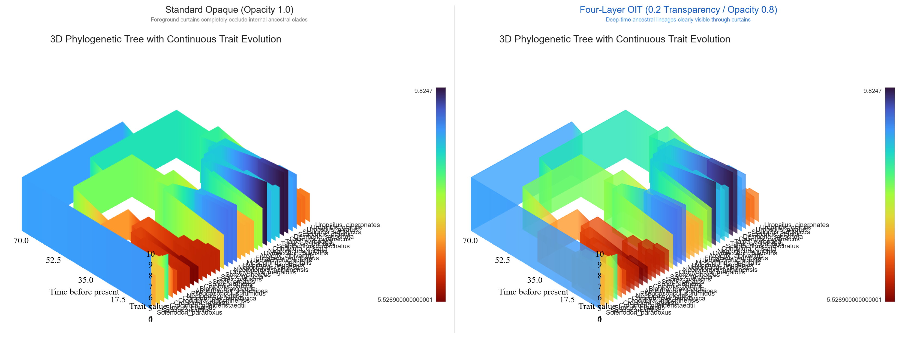
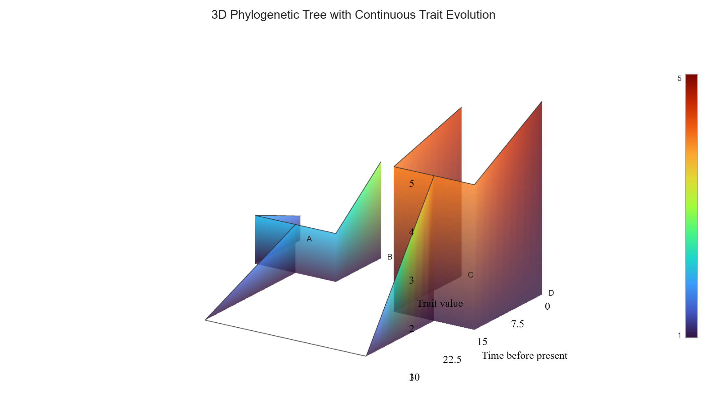
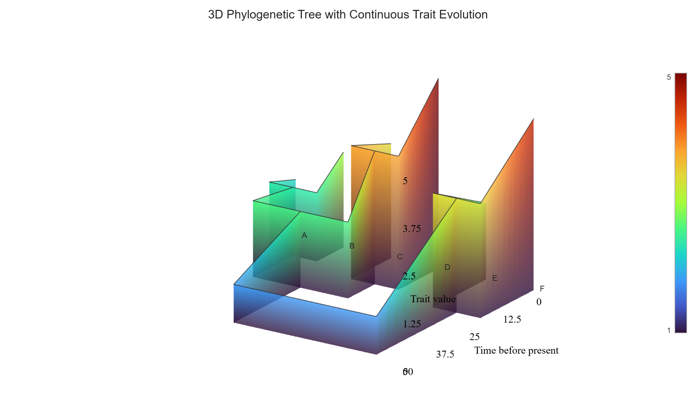

# Phylo3D-Trait: Deep-Time Macroevolutionary 3D Trait Visualization

[](https://pypi.org/project/phylo3d-trait/)
[](https://www.python.org/downloads/)
[](LICENSE)
[](https://github.com/hk20013106/Phylo3D-Trait/releases/latest)
[](https://github.com/hk20013106/Phylo3D-Trait/actions/workflows/tests.yml)
[]()

**Interactive 3D visualization of continuous trait evolution on phylogenetic trees.**

Phylo3D-Trait is a Python CLI and library for mapping continuous phenotypic, physiological, morphological, genomic, or other quantitative traits onto phylogenetic trees in interactive 3D. For dated trees, evolutionary time is shown explicitly along the Z axis.

**Input:** a Newick/Nexus phylogeny plus CSV/TSV values for terminal and ancestral nodes.  
**Output:** a standalone, offline-viewable WebGL2 HTML visualization combining phylogenetic topology, divergence time, continuous trait trajectories, ancestral-state estimates, interactive node inspection, and publication-quality PNG/SVG export.

Phylo3D-Trait is designed for **macroevolution, phylogenetic comparative biology, continuous-trait evolution, ancestral-state visualization, and scientific 3D phylogenetic visualization**. It visualizes supplied ancestral-state estimates; it does **not** infer phylogenies, date trees, or perform ancestral-state reconstruction (ASR). Results from workflows such as `phytools::fastAnc()`, `ape::ace()`, Brownian-motion models, or OU models can be supplied as node values.

Generates publication-oriented orthogonal rectangular phylograms with vertical curtain meshes. The recommended Four-Layer WebGL2 renderer uses bounded depth peeling for order-independent transparency while remaining self-contained in a single HTML file.

<p align="center">
  
</p>
<p align="center"><em>Real-world macroevolutionary dataset (Eulipotyphla, 38 species) rendered with the Four-Layer WebGL2 engine at 0.2 transparency (<code>--opacity 0.8</code>), featuring adaptive front-facing axes and camera-aware outward labels.</em></p>

> 🌐 **Project site**: https://hk20013106.github.io/Phylo3D-Trait/  
> 📖 **User & AI Agent Manual**: [`docs/PHYLO3D_TRAIT_USAGE_GUIDE.md`](docs/PHYLO3D_TRAIT_USAGE_GUIDE.md)  
> 🐛 **Bug reports / feature requests**: use [GitHub Issues](https://github.com/hk20013106/Phylo3D-Trait/issues). Pull requests are welcome; see [`CONTRIBUTING.md`](CONTRIBUTING.md).

---

## 1. Key Features & Architectural Innovations

- 🚀 **Dual Rendering Engines**:
  - **Fixed Four-Layer WebGL2 Depth Peeling (`--renderer four-layer`)** *(Recommended)*: Per-fragment Order-Independent Transparency (OIT) with zero external JavaScript dependencies (< 1 MB standalone HTML).
  - **Classic Plotly Backend (`--renderer plotly`)**: Familiar Plotly.js 3D scene engine with extensive camera and layout controls.
- 💎 **True Order-Independent Transparency (OIT)**:
  - Bounded fragment depth peeling peels the nearest 4 curtain layers per pixel.
  - Omission transmittance error is mathematically bounded ($\le 0.81\%$ at opacity 0.70; $\le 6.25\%$ at opacity 0.50; $\le 0.16\%$ at opacity 0.80).
  - **Zero trace-sorting artifacts**: Completely eliminates WebGL painter's algorithm sorting glitches, popping, and trace-clipping during 360° orbits.
- 📐 **Adaptive Front-Facing Scientific Axes (No Box Frame)**:
  - **Clean open aesthetic**: Obstructive 5-line 3D bounding box frames have been completely eliminated.
  - **Dynamic front-corner tracking (`frontAxisCorner`)**: Numerical axes for **Trait value ($Y$)** and **Time before present ($Z$, Ma)** automatically anchor to the viewer-facing front corner across all azimuth (`yaw`) and elevation (`pitch`) angles.
  - **Outward ticks & titles (`outward2D`)**: Axis ticks and labels always project outward into empty screen space, never penetrating or obscuring the phylogenetic tree.
- 🏷️ **Camera-Aware Species Label Anchoring**:
  - Species labels dynamically detect the camera azimuth hemisphere (`eyeX`).
  - Automatically flips alignment between positive and negative $X$ hemispheres (`translate(3px, -50%)` vs `translate(calc(-100% - 3px), -50%)`), guaranteeing taxon names project outward from tips without invading tree branches.
- 🔍 **Interactive Node Picking & Ancestral Diagnostics**:
  - **Terminal Tips**: Hover reveals Taxon name, Node ID, Trait value ($Y$), Evolutionary Time ($Z = 0$), and Tree Layout position ($X$).
  - **Ancestral Internal Nodes**: Hover reveals Clade hash ID, Ancestral Trait value ($Y$), Divergence Age ($Z$, Ma), Layout position ($X$), and descendant taxon summary.
  - **Visual Guidance**: High-contrast orange marker dot and dynamic vertical dashed projection line connecting nodes to the trait baseline.
- 💾 **Publication-Grade Export Toolbar**:
  - **Reset**: Instantly restore default camera preset (`yaw`, `pitch`, `zoom`).
  - **PNG Export**: 2× Retina resolution raster export capturing curtains, centerlines, axes, labels, and colorbar into a crisp publication-ready image.
  - **Hybrid SVG Export**: Native SVG packaging the WebGL 4-layer depth-peeled curtain raster inside an `<image>` element, with all axes, tick marks, titles, species labels, and colorbar exported as lossless, editable vector graphics (`<line>`, `<text>`, `<rect>`).
- 🔒 **Deterministic Clade Identity**:
  - Stable SHA-256 hash IDs for all ancestral nodes derived from alphabetically sorted descendant tip names (`clade:<hash>`).

### Order-Independent Transparency (OIT): Opaque vs 0.2 Transparency

<p align="center">
  
</p>

- **Left (Standard Opaque, `--opacity 1.0`)**: Foreground curtain walls completely occlude internal ancestral nodes, deeper clades, and branching topology.
- **Right (Four-Layer OIT, `--opacity 0.8`, 20% transparency)**: Fragment-level depth peeling renders deep-time ancestral lineages, intermediate clades, and trait shifts clearly visible through semi-transparent curtains without any trace-sorting artifacts or popping across 360° orbits.

---

## 2. Rendering Engines Comparison

| Feature / Capability | Four-Layer WebGL2 (`--renderer four-layer`) | Classic Plotly (`--renderer plotly`) |
| :--- | :--- | :--- |
| **Primary Use Case** | **Publication figures, transparency, clean presentation** | Standard exploration, legacy workflows |
| **Transparency Method** | **Fragment-level Depth Peeling (4 layers OIT)** | Primitive-level Painter's Algorithm |
| **Transparency Quality** | **Glitch-free across 360° orbits, no popping** | Trace sorting / camera sorting required |
| **HTML Bundle Size** | **Ultra-lightweight (< 1 MB self-contained)** | Heavier (~3.5 MB with Plotly.js CDN/bundle) |
| **JS Dependencies** | **Zero external libraries (pure native WebGL2 + SVG)** | Requires Plotly.js runtime |
| **Scientific Axes** | **Adaptive Front-Corner tracking (Y & Z only, No Box Frame)** | Full 3D Cartesian Bounding Box |
| **Interactive Hover** | **Tips + Internal Nodes (descendants & vertical guide line)** | Tips only (Scatter3d markers) |
| **Outward Label Flip** | **Native dynamic camera-aware flip** | Plotly textposition anchor |
| **Toolbar & Export** | **Built-in Reset, 2× PNG, and Hybrid Vector/Raster SVG** | Plotly standard modebar snapshot |

---

## 3. Scientific Coordinate System

The 3D space is mapped to an orthogonal rectangular phylogram:

| Axis | Scientific Meaning | Description |
|---|---|---|
| **$X$** | **Tree Layout** | Horizontal lineage separation ($0, 1, \dots, N-1$ at terminal tips; internal nodes positioned at children centroids). |
| **$Y$** | **Trait Value ("Height")** | Trait value directly determines vertical elevation in 3D space. Low trait $\rightarrow$ low $Y$; high trait $\rightarrow$ high $Y$. |
| **$Z$** | **Evolutionary Time** | Divergence age / time before present. Tips at $Z = 0$, internal nodes at $Z > 0$, root at $Z = \text{root\_age}$ (Ma). |

$$\text{Point}_k = (X_k, \text{Trait}_k, \text{Time}_k)$$

### Coupling of Height and Color
- **Top branch geometry** strictly obeys $Y = \text{Trait}$, and branch top lines are colored by the local trait value.
- **Curtain Mode `branch` (`--curtain-color-mode branch`)**: Vertically projects the local top branch trait color down each panel to the baseline. This removes artificial vertical gradients while preserving continuous evolutionary trait transitions along the branches.
- **Curtain Mode `height` (`--curtain-color-mode height`, default)**: Preserves the historical vertical gradient where `vertex color intensity == vertex Y`.
- **Independent Color Reversal (`--reverse-colorscale`)**: Reverses only the color palette lookup table without inverting trait heights or modifying scientific values.

> [!IMPORTANT]
> **No Built-in Ancestral State Reconstruction**:
> **Phylo3D-Trait is a visualization engine; it does not perform ASR.** All tip and ancestral node trait values must be reconstructed beforehand (e.g. via `phytools::fastAnc()`, `ape::ace()`, Brownian Motion, or OU models) and supplied in the input CSV/TSV table.

---

## 4. Quickstart: 3-Step Reproducible Workflow

### Step 1: Generate Node Values Template
Extract all tip names and canonical ancestral clade IDs from your tree:

```bash
python -m phylo3d_trait.cli template-values \
  --tree path/to/tree.nwk \
  --output path/to/node_values_template.csv
```

### Step 2: Fill in Trait Values
Fill in the `trait` column with your measured tip values and reconstructed ancestral states:

```csv
node_id,trait
Species_A,1.25
Species_B,2.10
Species_C,3.85
Species_D,4.50
clade:b17c8419f544,1.64
clade:6a5756530335,4.10
clade:17f5f129f4c7,2.50
```

> [!IMPORTANT]
> **Completeness Requirement**: All tips, internal nodes, and the root must have explicit numeric trait values. If any node is unassigned, the tool halts immediately with an informative error listing the missing nodes.

### Step 3: Render Interactive 3D Visualization
Render an interactive 3D HTML visualization using the **Four-Layer WebGL2 engine**:

```bash
python -m phylo3d_trait.cli plot \
  --tree path/to/tree.nwk \
  --values path/to/node_values.csv \
  --output path/to/tree3d.html \
  --renderer four-layer \
  --opacity 0.85 \
  --reverse-colorscale \
  --curtain-color-mode branch \
  --centerline-color trait
```

Open `tree3d.html` directly in any modern web browser — no web server or internet connection required!

---

## 5. Command Line Interface (CLI) Reference

The CLI is invoked via `python -m phylo3d_trait.cli <command>` (or `phylo3d-trait <command>` when installed).

### Subcommand: `template-values`
```bash
python -m phylo3d_trait.cli template-values -h
```
- `--tree, -t` *(required)*: Path to Newick or Nexus tree file.
- `--output, -o` *(required)*: Path to save the generated template CSV.
- `--default-val`: Optional placeholder string for the trait column (default: `""`).

### Subcommand: `plot`
```bash
python -m phylo3d_trait.cli plot -h
```

#### Core Inputs & Outputs
- `--tree, -t` *(required)*: Path to Newick or Nexus tree file.
- `--values, -v` *(required)*: Path to CSV or TSV trait values table.
- `--output, -o` *(required)*: Path to output standalone HTML file.
- `--title`: Title displayed above the 3D scene.
- `--renderer {four-layer, plotly}`: Rendering engine backend (default: `plotly`; `four-layer` recommended).

#### Rendering, Transparency & Aesthetics
- `--opacity`: Curtain mesh opacity (default: `1.0`). In `four-layer` mode, supports `0.5`–`1.0` (0%–50% transparency); in `plotly` mode, supports `0.0`–`1.0`.
- `--curtain-color-mode {branch, height}`: `branch` vertically projects local branch trait color; `height` applies a vertical gradient.
- `--centerline-color`: Branch top outline color (`dark` [default], `trait`, or custom CSS color).
- `--colorscale`: Continuous palette name (e.g. `Turbo`, `Viridis`, `Plasma`, `Spectral`, default: `Turbo`).
- `--reverse-colorscale`: Reverses color palette without altering trait heights or raw values.
- `--branch-width`: Line width for 3D branch top outlines (default: `1.0`).
- `--background {white, transparent}`: Background styling (default: `white`).
- `--segments, -s`: Linear interpolation subdivisions per branch (default: `10`).

#### Trait Geometry & Aspect Ratios
- `--baseline-y`: Custom baseline $Y$ trait plane elevation (default: minimum observed trait).
- `--baseline-raw-value`: Custom numeric trait value displayed at baseline $Y$ on axis and colorbar.
- `--trait-display-offset OFFSET`: Geometric zero shift ($Y_{\text{display}} = \text{Trait}_{\text{raw}} - \text{OFFSET}$). Axis ticks and hover tooltips still show raw scientific values.
- `--trait-display-range START END`: Linear remapping of raw traits `[min, max]` to target display coordinates `[START, END]`.
- `--trait-axis-scale SCALE`: Visual-only Trait ($Y$) axis aspect ratio multiplier (default: `1.0`). E.g., `0.5` compresses visual height by half; `1.5` stretches it by 150%. Scientific values, ticks, colors, and mesh coordinates remain uncorrupted.

#### Camera, Labels & Viewport
- `--camera-preset {elife, root_front, tips_front}`: Initial camera angle (default: `elife`).
- `--tip-label-offset FRACTION`: Outward offset of terminal species labels beyond the present plane, expressed as a fraction of time span (default: `0.03`).
- `--no-labels`: Disable terminal taxon labels along the Tree Layout axis.

#### Display Toggles (Visual-Only Layer)
- `--no-x-axis`: Hide Tree Layout ($X$) axis line and baseline markers.
- `--no-y-axis`: Hide Trait value ($Y$) numerical axis line, ticks, labels, and title.
- `--no-z-axis`: Hide Time before present ($Z$) numerical axis line, ticks, labels, and title.
- `--no-tip-hover`: Disable interactive hover tooltip and indicator on terminal tip taxa.
- `--no-internal-hover`: Disable interactive hover tooltip and indicator on internal ancestral nodes.
- `--no-mesh`: Disable continuous curtain mesh surfaces.
- `--no-centerline`: Disable branch top centerline outlines.
- `--show-node-markers`: Render diamond markers at ancestral nodes (default: `False`).

---

## 6. Python API Reference

Phylo3D-Trait can be integrated directly into Python pipelines and computational workflows:

```python
from phylo3d_trait import (
    parse_tree,
    build_plot_data,
    build_figure,
    build_four_layer_html,
)
from phylo3d_trait.io import load_trait_values

# 1. Parse tree and load trait table
tree = parse_tree("path/to/tree.nwk")
traits = load_trait_values("path/to/node_values.csv")

# 2. Build 3D plot data model
plot_data = build_plot_data(
    tree_input=tree,
    trait_values=traits,
    num_segments=10,
    colorscale="Turbo",
    curtain_color_mode="branch",
    reverse_colorscale=True,
)

# 3A. Render with modern Four-Layer WebGL2 engine (OIT + Adaptive Axes)
html_content = build_four_layer_html(
    plot_data=plot_data,
    opacity=0.85,
    camera_preset="elife",
    centerline_color="trait",
)
with open("tree3d_four_layer.html", "w", encoding="utf-8") as f:
    f.write(html_content)

# 3B. Or render with classic Plotly engine
fig = build_figure(
    plot_data=plot_data,
    camera_preset="elife",
    background="white",
)
fig.write_html("tree3d_plotly.html", include_plotlyjs="cdn")
```

---

## 7. Built-in Examples

### Example 1: Standard 4-Taxon Dated Phylogeny
- **Tree**: [`examples/example1/tree.nwk`](examples/example1/tree.nwk) (ultrametric dated tree)
- **Trait table**: [`examples/example1/node_values.csv`](examples/example1/node_values.csv)
- **Output preview**: [`examples/example1/tree3d.html`](examples/example1/tree3d.html)

<p align="center">
  
</p>

### Example 2: 6-Taxon Nested Phylogeny with Baseline $Y = 0$
- **Tree**: [`examples/example2/tree.nwk`](examples/example2/tree.nwk) (nested multi-level clades)
- **Trait table**: [`examples/example2/node_values.csv`](examples/example2/node_values.csv)
- **Command**:
  ```bash
  python -m phylo3d_trait.cli plot \
    --tree examples/example2/tree.nwk \
    --values examples/example2/node_values.csv \
    --output examples/example2/tree3d.html \
    --baseline-y 0 \
    --renderer four-layer
  ```

<p align="center">
  
</p>

---

## 8. Installation & Testing

Install the stable release from PyPI:

```bash
pip install phylo3d-trait
phylo3d-trait --help
```

For development from source:

```bash
git clone https://github.com/hk20013106/Phylo3D-Trait.git
cd Phylo3D-Trait
pip install -e ".[dev]"
pytest tests/ -v
```

---

## 9. Citation, Support & Contributing

If you use **Phylo3D-Trait** in research, cite the software using [`CITATION.cff`](CITATION.cff). A DOI will be added after archival release.

Current software citation:

> He, K. (2026). *Phylo3D-Trait: Deep-Time Macroevolutionary 3D Trait Visualization*, version 0.3.1. GitHub: https://github.com/hk20013106/Phylo3D-Trait

The motivating macroevolutionary application concerns hemoglobin buffering power ($\beta\text{Hb4}$) and respiratory adaptation across deep-time mammal and bird phylogenies.

### Contributing

Bug reports, reproducible rendering problems, feature requests, documentation improvements, and pull requests are welcome. Please use the GitHub issue templates and include the smallest reproducible tree/value files when reporting a visualization or parsing bug. See [`CONTRIBUTING.md`](CONTRIBUTING.md) before submitting code.

### Project scope

Phylo3D-Trait is a visualization engine. It does not perform phylogenetic inference, tree dating, sequence analysis, statistical model fitting, or ancestral-state reconstruction.
