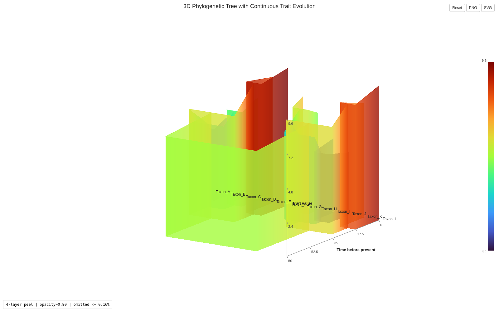
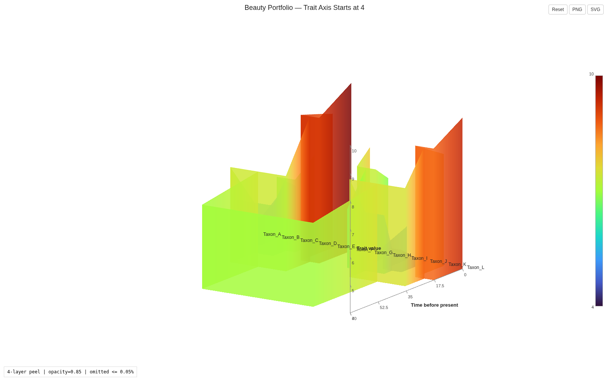
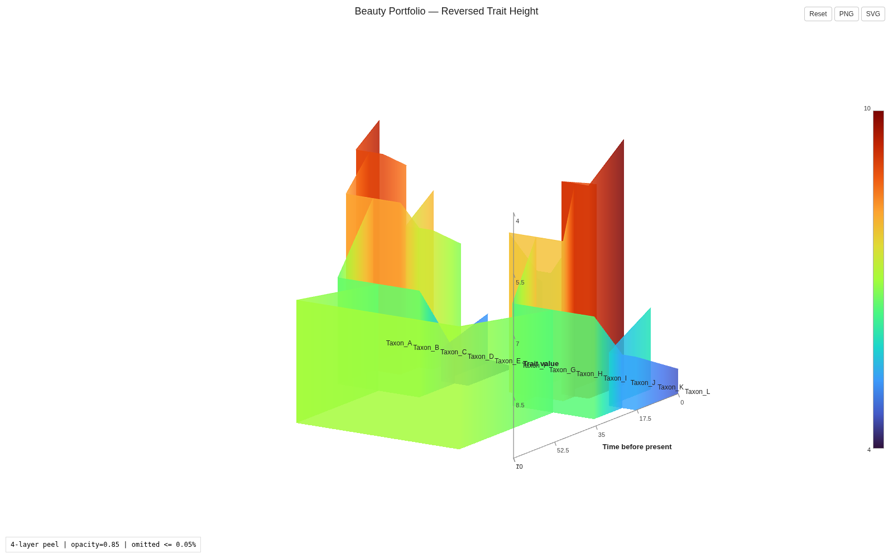
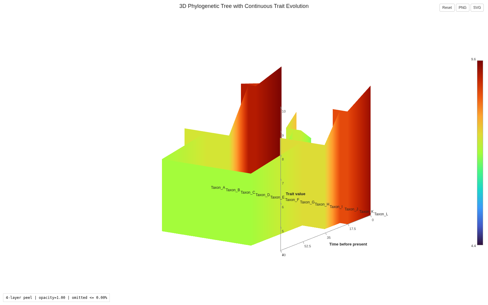
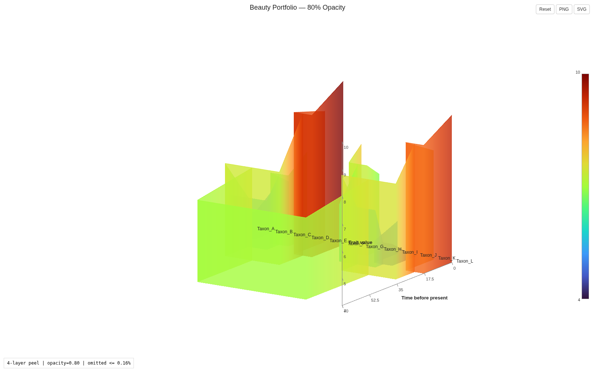
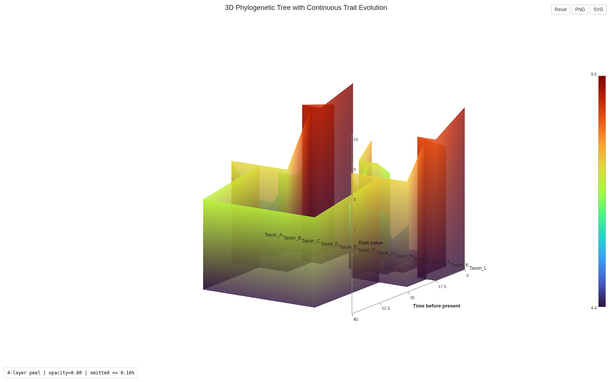
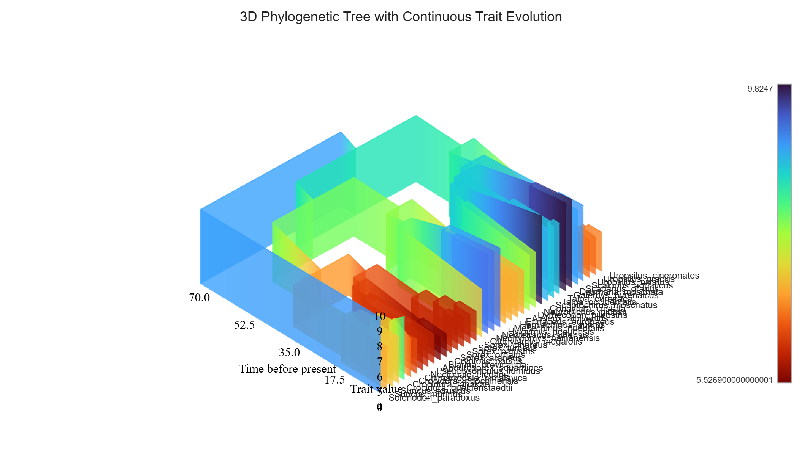

# Phylo3D-Trait Tutorial

**Goal:** start from a phylogenetic tree plus observed tip traits, derive stable ancestral-node IDs, add externally reconstructed ancestral traits, and produce an interactive 3D HTML visualization.

The important distinction is between **starting files**, **derived intermediate files**, and the **final Phylo3D-Trait input**:

```text
STARTING FILES
tree.nwk + tip_traits.csv
          |
          |  template-values
          v
DERIVED NODE TEMPLATE
node_values_template.csv
          |
          |  external ASR / ancestral trait calculation
          v
ANCESTRAL TRAITS
ancestral_traits.csv
          |
          |  merge with observed tip traits
          v
FINAL PHYLO3D INPUT
node_values.csv
          |
          |  phylo3d-trait plot
          v
OUTPUT
tree3d.html
```

> **Phylo3D-Trait does not reconstruct ancestral states.** It generates stable node IDs and visualizes trait values supplied for those nodes.

---

## 1. Install

Install the stable release from PyPI:

```bash
pip install phylo3d-trait
```

Verify:

```bash
phylo3d-trait --help
```

Expected subcommands:

```text
plot
template-values
```

Equivalent module form:

```bash
python -m phylo3d_trait.cli --help
```

Python requirement: **3.10+**.

---

## 2. Start with two files

At the beginning of an analysis you need:

1. the phylogenetic tree;
2. observed trait values for the terminal taxa.

You do **not** need to know the ancestral `clade:<hash>` IDs yet, and you should not invent them.

### 2.1 Phylogenetic tree

Example `tree.nwk`:

```text
((A:10.0,B:10.0):20.0,(C:15.0,D:15.0):15.0);
```

Supported formats are Newick and Nexus.

For a dated/ultrametric tree, branch lengths can represent evolutionary time and the Z axis can be interpreted as time before present. If branch lengths are substitutions/site or their meaning is unknown, do **not** label the Z axis as Ma.

### 2.2 Observed tip traits

Example `tip_traits.csv`:

```csv
node_id,trait
A,1.5
B,3.0
C,4.5
D,5.0
```

At this stage the file contains **tips only**. These may be measured phenotypes, physiological values, morphological measurements, genomic quantities, or other continuous traits.

The tip names must match the tree tip labels exactly.

---

## 3. Generate stable IDs for every ancestral node

The tree determines which internal nodes exist. Let Phylo3D-Trait calculate their stable IDs:

```bash
phylo3d-trait template-values \
  --tree tree.nwk \
  --output node_values_template.csv
```

For the toy tree, the generated file contains:

```csv
node_id,label,node_type,descendant_count,descendant_tips,trait
A,A,tip,1,A,
B,B,tip,1,B,
C,C,tip,1,C,
D,D,tip,1,D,
clade:17f5f129f4c7,clade:17f5f129f4c7,root,4,A;B;C;D,
clade:b17c8419f544,clade:b17c8419f544,internal,2,A;B,
clade:6a5756530335,clade:6a5756530335,internal,2,C;D,
```

The human-readable `descendant_tips` column tells you exactly what each hash represents:

```text
A;B     -> clade:b17c8419f544
C;D     -> clade:6a5756530335
A;B;C;D -> clade:17f5f129f4c7   (root)
```

### How the hash is calculated

For each internal node:

```text
descendant tip names
-> trim whitespace
-> remove duplicates
-> lexicographically sort
-> join with "," and no spaces
-> SHA-256
-> first 12 lowercase hexadecimal characters
-> prefix "clade:"
```

Exact rule:

```python
clade_id = "clade:" + sha256(
    ",".join(sorted(set(descendant_tips))).encode("utf-8")
).hexdigest()[:12]
```

Example:

```text
descendant tips: B, A
canonical key:   A,B
SHA-256 prefix:  b17c8419f544
stable node ID:  clade:b17c8419f544
```

Thus `(A,B)` and `(B,A)` give the same ID. Taxon spelling, capitalization, and punctuation still matter.

**Normal users and AI agents should run `template-values`, not calculate hashes manually.**

---

## 4. Obtain ancestral trait values

Now the node identities are known. The next step is scientific inference: obtain a trait value for every internal node and the root.

Phylo3D-Trait deliberately does **not** choose the reconstruction model for you. The appropriate method depends on the biological question.

Possible sources include:

- continuous-trait ASR such as `phytools::fastAnc()` or `ape::ace()`;
- BM/OU or Bayesian comparative models;
- ancestral sequence reconstruction followed by a sequence-to-phenotype calculation;
- experimentally or externally estimated ancestral values.

### 4.1 Reproducible continuous-trait example with `fastAnc`

The following R example starts from the same two initial files, estimates ancestral states, and converts R's temporary node numbers to the same stable `clade:<hash>` identifiers used by Phylo3D-Trait:

```r
library(ape)
library(phytools)
library(digest)

tree <- read.tree("tree.nwk")
tips <- read.csv("tip_traits.csv", stringsAsFactors = FALSE)

x <- setNames(tips$trait, tips$node_id)
stopifnot(setequal(names(x), tree$tip.label))

anc <- fastAnc(tree, x)

stable_id <- function(node) {
  descendants <- phytools::getDescendants(tree, node)
  tip_ids <- descendants[descendants <= Ntip(tree)]
  tip_names <- sort(unique(trimws(tree$tip.label[tip_ids])))
  key <- paste(tip_names, collapse = ",")
  paste0("clade:", substr(digest(key, algo = "sha256", serialize = FALSE), 1, 12))
}

ancestral_traits <- data.frame(
  node_id = vapply(as.integer(names(anc)), stable_id, character(1)),
  trait = as.numeric(anc)
)

write.csv(ancestral_traits, "ancestral_traits.csv", row.names = FALSE)
```

This produces a simple table:

```csv
node_id,trait
clade:b17c8419f544,...
clade:6a5756530335,...
clade:17f5f129f4c7,...
```

`fastAnc` is an **example**, not a requirement. Do not use it automatically when the biology calls for a different ancestral reconstruction.

---

## 5. Assemble the final `node_values.csv`

At this point you have:

```text
tip_traits.csv          # observed terminal values
ancestral_traits.csv    # reconstructed internal/root values
node_values_template.csv
```

Merge the two trait sources onto the generated template:

```python
import pandas as pd

template = pd.read_csv("node_values_template.csv")
tips = pd.read_csv("tip_traits.csv")
ancestors = pd.read_csv("ancestral_traits.csv")

values = pd.concat([tips, ancestors], ignore_index=True)

final = (
    template.drop(columns=["trait"])
    .merge(values, on="node_id", how="left", validate="one_to_one")
)

if final["trait"].isna().any():
    missing = final.loc[final["trait"].isna(), "node_id"].tolist()
    raise ValueError(f"Missing trait values: {missing}")

final.to_csv("node_values.csv", index=False)
```

The final file now contains a numeric trait for **every tip, every internal node, and the root**. This—not the original tip-only table—is the trait file passed to `phylo3d-trait plot`.

---

## 6. Run Phylo3D-Trait

Recommended Four-Layer render:

```bash
phylo3d-trait plot \
  --tree tree.nwk \
  --values node_values.csv \
  --output tree3d.html \
  --renderer four-layer \
  --opacity 0.85 \
  --curtain-color-mode branch \
  --centerline-color trait
```

A successful run ends with:

```text
Successfully generated 3D phylogenetic visualization: tree3d.html
```

Open `tree3d.html` in a modern browser.

The minimum plotting command is:

```bash
phylo3d-trait plot \
  --tree tree.nwk \
  --values node_values.csv \
  --output tree3d.html
```

The default renderer is currently `plotly`; explicitly select `--renderer four-layer` for the publication-oriented WebGL2 renderer.

---

## 7. Visual Portfolio: six ways to render the same data

The [Beauty Portfolio](https://github.com/hk20013106/Phylo3D-Trait/tree/main/examples/beauty_portfolio) is a synthetic 12-taxon dataset created specifically for learning display controls. Every panel below uses the **same tree and the same raw node values**. Only presentation parameters change.

This is the safest way to understand what a display option does: change one visual decision at a time while holding the data fixed.

### 7.1 Full trait scale from 0 to 10

Use a zero baseline and leave the raw trait geometry unchanged. The portfolio values span exactly 4.0–10.0. With a zero curtain baseline, the visible Y axis therefore runs from 0 to 10.

```bash
phylo3d-trait plot \
  --tree examples/beauty_portfolio/tree.nwk \
  --values examples/beauty_portfolio/node_values.csv \
  --output beauty_01_0_to_10.html \
  --renderer four-layer \
  --baseline-y 0 \
  --opacity 0.85 \
  --curtain-color-mode branch \
  --centerline-color trait \
  --title "Beauty Portfolio — Baseline 0 to 10"
```



**What changes:** only the curtain baseline is forced to Y = 0. Raw trait values, colors, topology, and time remain unchanged.

### 7.2 Start the scientific trait axis at 4

For traits that never approach zero, subtract a display offset while keeping the scientific labels and hover values in the original scale.

```bash
phylo3d-trait plot \
  --tree examples/beauty_portfolio/tree.nwk \
  --values examples/beauty_portfolio/node_values.csv \
  --output beauty_02_offset4.html \
  --renderer four-layer \
  --trait-display-offset 4 \
  --baseline-y 0 \
  --opacity 0.85 \
  --curtain-color-mode branch \
  --centerline-color trait \
  --title "Beauty Portfolio — Trait Axis Starts at 4"
```



The geometry uses:

```text
Y_display = trait_raw - 4
```

but the Y-axis ticks and hover cards still report the **raw scientific values**. Thus the baseline is visually Y = 0 while its scientific label is 4.

### 7.3 Reverse the vertical trait direction

A descending display can be useful when the biological interpretation is easier to read with larger raw values lower in the scene. This is a geometry transform, not a color reversal.

```bash
phylo3d-trait plot \
  --tree examples/beauty_portfolio/tree.nwk \
  --values examples/beauty_portfolio/node_values.csv \
  --output beauty_03_reversed_height.html \
  --renderer four-layer \
  --trait-display-range 10 4 \
  --baseline-y 4 \
  --opacity 0.85 \
  --curtain-color-mode branch \
  --centerline-color trait \
  --title "Beauty Portfolio — Reversed Trait Height"
```



Here the raw minimum maps to the top of the display range and the raw maximum maps to the bottom. Raw values remain available in axis labels and hover metadata.

> `--trait-display-range 10 4` reverses **height geometry**. It is different from `--reverse-colorscale`, which reverses only palette lookup.

### 7.4 Fully opaque curtains

Set `--opacity 1.0` for completely opaque curtain surfaces.

```bash
phylo3d-trait plot \
  --tree examples/beauty_portfolio/tree.nwk \
  --values examples/beauty_portfolio/node_values.csv \
  --output beauty_04_opaque.html \
  --renderer four-layer \
  --trait-display-offset 4 \
  --baseline-y 0 \
  --opacity 1.0 \
  --curtain-color-mode branch \
  --centerline-color trait \
  --title "Beauty Portfolio — 100% Opaque"
```



Opaque surfaces emphasize the front-most geometry but can hide deeper branches.

### 7.5 80% opacity / 20% transparency

Set `--opacity 0.8` to retain 80% opacity while allowing deeper lineages to remain visible through the curtains.

```bash
phylo3d-trait plot \
  --tree examples/beauty_portfolio/tree.nwk \
  --values examples/beauty_portfolio/node_values.csv \
  --output beauty_05_opacity80.html \
  --renderer four-layer \
  --trait-display-offset 4 \
  --baseline-y 0 \
  --opacity 0.8 \
  --curtain-color-mode branch \
  --centerline-color trait \
  --title "Beauty Portfolio — 80% Opacity"
```



This is the same geometry as 7.4. Only opacity changes, so the difference directly demonstrates the Four-Layer transparency renderer.

### 7.6 Use the alternative curtain-coloring mode

The previous portfolio panels use `--curtain-color-mode branch`: each curtain column inherits the local branch trait color vertically. The alternative `height` mode colors vertices according to their Y position and therefore creates a vertical gradient.

```bash
phylo3d-trait plot \
  --tree examples/beauty_portfolio/tree.nwk \
  --values examples/beauty_portfolio/node_values.csv \
  --output beauty_06_height_color.html \
  --renderer four-layer \
  --trait-display-offset 4 \
  --baseline-y 0 \
  --opacity 0.8 \
  --curtain-color-mode height \
  --centerline-color trait \
  --title "Beauty Portfolio — Height-based Curtain Color"
```



Use the modes according to what you want the curtain to communicate:

```text
branch  -> color follows the local branch trait and is projected vertically
height  -> color follows vertical Y position and forms a gradient
```

All six panels use identical node values. Therefore differences among the figures are presentation effects, not biological differences.

---

## 8. Real-data example: Eulipotyphla Hb buffering evolution

The repository includes a 38-species Eulipotyphla dataset under [`examples/eulipotyphla/`](https://github.com/hk20013106/Phylo3D-Trait/tree/main/examples/eulipotyphla).



*Renderer preview from the validated Eulipotyphla development artifact. This figure demonstrates the scale, topology, transparency, labels, and overall visual appearance of a real-data analysis. It is **not** presented as the final sequence-based ancestral Hb4 reconstruction described below; the current scientific workflow requires sequence-derived ancestral HBA_T1/HBB_T1 values before a final biological figure is released.*

The public example contains:

```text
examples/eulipotyphla/
├── tree_eulipotyphla.nwk
├── tip_traits.csv
└── README.md
```

These are the **starting data**, not a pre-filled final node table.

### 8.1 Generate all 37 ancestral/root IDs

```bash
phylo3d-trait template-values \
  --tree examples/eulipotyphla/tree_eulipotyphla.nwk \
  --output examples/eulipotyphla/node_values_template.csv
```

Validation targets:

```text
38 tips
37 internal/root nodes
75 total nodes
root = clade:6747b5f19c9e
```

### 8.2 Obtain ancestral Hb4 values

For this biological analysis, do **not** use the historical Brownian/fastAnc internal-node values as a fallback.

The intended scientific route is sequence-based:

```text
dated Eulipotyphla tree
        +
IQ-TREE 2 ML ancestral HBA_T1 and HBB_T1 sequences
        |
        | same sequence-to-buffer calculation used for extant species
        v
ancestral beta_HBA_T1 and beta_HBB_T1
        |
        v
beta_Hb4 = 2 * (beta_HBA_T1 + beta_HBB_T1)
        |
        | match each ancestral sequence node to descendant-tip set
        | -> same clade:<hash> ID
        v
37 ancestral/root Hb4 values
```

The 38 extant values in `tip_traits.csv` are retained unchanged.

The historical character-based Brownian table is intentionally **not** included in this example because it is not the accepted ancestral Hb4 source for this analysis. The exact sequence-derived 37-node table should be committed only after those upstream values are available and verified; it must not be fabricated from the old Brownian reconstruction.

### 8.3 Assemble and render

Once the verified sequence-derived table is available, merge it with `tip_traits.csv` using Step 5 and save:

```text
examples/eulipotyphla/node_values_sequence_based.csv
```

Then render:

```bash
phylo3d-trait plot \
  --tree examples/eulipotyphla/tree_eulipotyphla.nwk \
  --values examples/eulipotyphla/node_values_sequence_based.csv \
  --output eulipotyphla_Hb_3D_sequence_based.html \
  --renderer four-layer \
  --camera-preset elife \
  --trait-display-offset 4 \
  --baseline-y 0 \
  --trait-axis-scale 0.5 \
  --tip-label-offset 0.03 \
  --reverse-colorscale \
  --curtain-color-mode branch \
  --opacity 0.8
```

This example illustrates why the workflow separates **node identity** from **ancestral trait inference**: Phylo3D-Trait determines stable node IDs from topology, while the biological analysis determines what trait value belongs to each node.

---

## 9. Command Line Interface (CLI) Reference

The CLI is invoked via `python -m phylo3d_trait.cli <command>` (or `phylo3d-trait <command>` when installed).

### Subcommand: `template-values`
```bash
python -m phylo3d_trait.cli template-values -h
```
- `--tree, -t` *(required)*: Path to Newick or Nexus tree file.
- `--output, -o` *(required)*: Path to save the generated template CSV.
- `--default-val`: Optional placeholder string for the trait column (default: `""`).

### Subcommand: `plot`
```bash
python -m phylo3d_trait.cli plot -h
```

#### Core Inputs & Outputs
- `--tree, -t` *(required)*: Path to Newick or Nexus tree file.
- `--values, -v` *(required)*: Path to CSV or TSV trait values table.
- `--output, -o` *(required)*: Path to output standalone HTML file.
- `--title`: Title displayed above the 3D scene.
- `--renderer {four-layer, plotly}`: Rendering engine backend (default: `plotly`; `four-layer` recommended).

#### Rendering, Transparency & Aesthetics
- `--opacity`: Curtain mesh opacity (default: `1.0`). In `four-layer` mode, supports `0.5`–`1.0` (0%–50% transparency); in `plotly` mode, supports `0.0`–`1.0`.
- `--curtain-color-mode {branch, height}`: `branch` vertically projects local branch trait color; `height` applies a vertical gradient.
- `--centerline-color`: Branch top outline color (`dark` [default], `trait`, or custom CSS color).
- `--colorscale`: Continuous palette name (e.g. `Turbo`, `Viridis`, `Plasma`, `Spectral`, default: `Turbo`).
- `--reverse-colorscale`: Reverses color palette without altering trait heights or raw values.
- `--branch-width`: Line width for 3D branch top outlines (default: `1.0`).
- `--background {white, transparent}`: Background styling (default: `white`).
- `--segments, -s`: Linear interpolation subdivisions per branch (default: `10`).

#### Trait Geometry & Aspect Ratios
- `--baseline-y`: Custom baseline $Y$ trait plane elevation (default: minimum observed trait).
- `--baseline-raw-value`: Custom numeric trait value displayed at baseline $Y$ on axis and colorbar.
- `--trait-display-offset OFFSET`: Geometric zero shift ($Y_{\text{display}} = \text{Trait}_{\text{raw}} - \text{OFFSET}$). Axis ticks and hover tooltips still show raw scientific values.
- `--trait-display-range START END`: Linear remapping of raw traits `[min, max]` to target display coordinates `[START, END]`.
- `--trait-axis-scale SCALE`: Visual-only Trait ($Y$) axis aspect ratio multiplier (default: `1.0`). E.g., `0.5` compresses visual height by half; `1.5` stretches it by 150%. Scientific values, ticks, colors, and mesh coordinates remain uncorrupted.

#### Camera, Labels & Viewport
- `--camera-preset {elife, root_front, tips_front}`: Initial camera angle (default: `elife`).
- `--tip-label-offset FRACTION`: Outward offset of terminal species labels beyond the present plane, expressed as a fraction of time span (default: `0.03`).
- `--no-labels`: Disable terminal taxon labels along the Tree Layout axis.

#### Display Toggles (Visual-Only Layer)
- `--no-x-axis`: Hide Tree Layout ($X$) axis line and baseline markers.
- `--no-y-axis`: Hide Trait value ($Y$) numerical axis line, ticks, labels, and title.
- `--no-z-axis`: Hide Time before present ($Z$) numerical axis line, ticks, labels, and title.
- `--no-tip-hover`: Disable interactive hover tooltip and indicator on terminal tip taxa.
- `--no-internal-hover`: Disable interactive hover tooltip and indicator on internal ancestral nodes.
- `--no-mesh`: Disable continuous curtain mesh surfaces.
- `--no-centerline`: Disable branch top centerline outlines.
- `--show-node-markers`: Render diamond markers at ancestral nodes (default: `False`).

---

## 10. Python API Reference

Phylo3D-Trait can be integrated directly into Python pipelines and computational workflows:

```python
from phylo3d_trait import (
    parse_tree,
    build_plot_data,
    build_figure,
    build_four_layer_html,
)
from phylo3d_trait.io import load_trait_values

# 1. Parse tree and load trait table
tree = parse_tree("path/to/tree.nwk")
traits = load_trait_values("path/to/node_values.csv")

# 2. Build 3D plot data model
plot_data = build_plot_data(
    tree_input=tree,
    trait_values=traits,
    num_segments=10,
    colorscale="Turbo",
    curtain_color_mode="branch",
    reverse_colorscale=True,
)

# 3A. Render with modern Four-Layer WebGL2 engine (OIT + Adaptive Axes)
html_content = build_four_layer_html(
    plot_data=plot_data,
    opacity=0.85,
    camera_preset="elife",
    centerline_color="trait",
)
with open("tree3d_four_layer.html", "w", encoding="utf-8") as f:
    f.write(html_content)

# 3B. Or render with classic Plotly engine
fig = build_figure(
    plot_data=plot_data,
    camera_preset="elife",
    background="white",
)
fig.write_html("tree3d_plotly.html", include_plotlyjs="cdn")
```

---

## AI execution contract

An AI agent should reason about files by provenance, not by filename alone:

```text
STARTING INPUTS:
- exact Newick/Nexus tree
- observed tip-only trait table

DERIVED:
- node_values_template.csv from template-values
- ancestral_traits.csv from an explicit external scientific method
- node_values.csv from merging observed tips + reconstructed ancestors

PROCEDURE:
1. Inspect the exact tree and determine what branch lengths mean.
2. Verify tip trait names match tree tip labels exactly.
3. Run template-values; never invent clade hashes.
4. Obtain ancestral trait values using the user-specified scientific method.
5. Map ancestors to the stable IDs generated from the exact tree.
6. Merge tip and ancestral values onto the template.
7. Fail if any required node lacks a numeric trait.
8. Run plot and report the exact output path.

MUST NOT:
- treat the final node_values.csv as an unexplained starting file;
- invent or hand-edit clade hashes;
- silently choose an ASR model;
- use historical/fallback ancestral values when the user specifies another method;
- interpret substitution branch lengths as Ma;
- modify package source merely because a new dataset is supplied.
```

---

## Examples in this repository

- [Beauty Portfolio visual-parameter example](https://github.com/hk20013106/Phylo3D-Trait/tree/main/examples/beauty_portfolio)
- [Nested 6-taxon regression/example dataset](https://github.com/hk20013106/Phylo3D-Trait/tree/main/examples/example2)
- [Real-data Eulipotyphla starting dataset and sequence-based workflow](https://github.com/hk20013106/Phylo3D-Trait/tree/main/examples/eulipotyphla)

These links open the corresponding directories in the GitHub repository. The GitHub Pages site is built from `docs/` only, so repository-level `examples/` directories are not published as Pages routes.

For deeper implementation notes and agent guardrails, see the [User & AI Agent Guide](PHYLO3D_TRAIT_USAGE_GUIDE.md).
